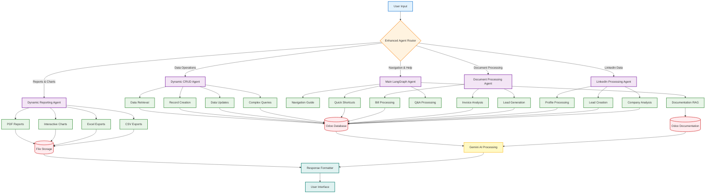

# OdooSense_V2 🤖

**A Comprehensive Suite of AI Agents for Effortless Odoo Management**

OdooSense_V2 is an advanced AI-powered platform that transforms how you interact with Odoo ERP systems. Built with cutting-edge LangChain and LangGraph technologies, it provides intelligent agents that understand natural language and execute complex Odoo operations seamlessly.

## 🌟 Overview

OdooSense_V2 eliminates the complexity of traditional ERP interactions by providing conversational AI agents that can:
- **Understand natural language queries** in plain English
- **Execute complex Odoo operations** without technical knowledge
- **Generate professional reports** in multiple formats (PDF, Excel, CSV)
- **Create interactive visualizations** and charts
- **Navigate Odoo modules** intelligently
- **Process documents** and extract data automatically
- **Manage CRUD operations** with conversational ease

## 🔄 Project Workflow Diagram



### 🔍 Workflow Explanation

1. **User Input**: User sends a natural language query through the chat interface
2. **Enhanced Agent Router**: Analyzes intent and routes to the appropriate specialized agent
3. **Specialized Agent Processing**: Each agent handles specific operations:
   - **Dynamic CRUD Agent**: Data retrieval, record creation, updates, and complex queries
   - **Dynamic Reporting Agent**: PDF reports, interactive charts, Excel/CSV exports
   - **Main LangGraph Agent**: Navigation guidance, documentation RAG, shortcuts, Q&A
   - **Document Processing Agent**: Bill processing, invoice analysis, lead generation
   - **LinkedIn Processing Agent**: Profile processing, lead creation, company analysis
4. **Data Layer Interaction**: 
   - **Odoo Database**: Core ERP data storage and retrieval
   - **File Storage**: Generated reports and exported files
   - **Odoo Documentation**: Knowledge base for RAG functionality
5. **AI Processing**: Gemini AI processes queries and generates intelligent responses
6. **Response Formatting**: Results are formatted and delivered through the user interface

### 🎨 Diagram Legend
- **Blue**: User interaction layer
- **Orange**: Routing and decision logic
- **Purple**: AI agent services
- **Green**: Specific operations and functions
- **Red**: Data storage and databases
- **Yellow**: AI processing engine
- **Teal**: Response and interface layer

## 🤖 AI Agents Suite

### 1. **Enhanced Agent Router** 🎯
*The intelligent traffic controller*

**Purpose**: Routes user queries to the most appropriate specialized agent based on intent analysis.

**Capabilities**:
- Natural language intent classification
- Intelligent query routing
- Session and credential management
- Multi-agent coordination
- Error handling and fallback mechanisms

**When it activates**: Every user interaction starts here for optimal routing.

---

### 2. **Dynamic CRUD Agent** 📊
*Your data operations specialist*

**Purpose**: Handles all data lookup, creation, reading, updating, and deletion operations in Odoo.

**Capabilities**:
- **Data Retrieval**: Find customers, products, orders, invoices, employees
- **Record Creation**: Create new leads, contacts, sales orders, expenses
- **Data Updates**: Modify existing records with natural language
- **Complex Queries**: Multi-table joins and advanced filtering
- **Textual Reports**: Generate formatted text-based reports and summaries
- **Data Analysis**: Provide insights and breakdowns of business data

**Technologies**: LangChain agents with dynamic tool generation, Gemini AI integration

---

### 3. **Dynamic Reporting Agent** 📈
*Your visualization and export expert*

**Purpose**: Generates professional reports, charts, and exports data in various formats.

**Capabilities**:
- **PDF Reports**: Professional formatted reports with tables and styling
- **Interactive Charts**: Bar charts, line graphs, pie charts, scatter plots
- **Excel Exports**: Formatted spreadsheets with auto-sizing and styling
- **CSV Exports**: Clean data exports for further analysis
- **Data Visualizations**: Plotly-powered interactive charts
- **Dashboard Creation**: Multi-chart dashboards and analytics

**Technologies**: ReportLab (PDF), Plotly (Charts), OpenPyXL (Excel), Pandas (Data processing)

---

### 4. **Main LangGraph Agent** 🧠
*The core intelligence hub*

**Purpose**: Handles navigation, documentation, Q&A, and complex multi-step workflows.

**Capabilities**:
- **Navigation Assistance**: Guide users through Odoo modules and menus
- **Documentation RAG**: Answer how-to queries using official Odoo documentation with intelligent retrieval
- **Quick Shortcuts**: Provide direct links and shortcuts to relevant Odoo records and pages
- **Document Processing**: Extract data from uploaded files (bills, invoices, etc.)
- **LinkedIn Integration**: Process LinkedIn data and create leads
- **Multi-step Workflows**: Handle complex business processes
- **Session Management**: Maintain conversation context and memory

**Technologies**: LangGraph state machines, Multi-node processing, Advanced RAG on Odoo documentation

---

### 5. **Document Processing Agent** 📄
*Your document intelligence specialist*

**Purpose**: Extracts and processes data from various document types.

**Capabilities**:
- **Bill Processing**: Extract vendor, amount, and line items
- **Invoice Analysis**: Parse customer invoices and payment terms
- **Lead Generation**: Convert business cards and contact info
- **Expense Management**: Process expense receipts and categorize
- **Multi-format Support**: PDF, images, text documents
- **Automatic Classification**: Identify document types automatically

---

### 6. **LinkedIn Processing Agent** 🔗
*Your social business intelligence*

**Purpose**: Processes LinkedIn data and converts it into actionable Odoo records.

**Capabilities**:
- **Profile Processing**: Extract contact information from LinkedIn profiles
- **Lead Creation**: Convert LinkedIn contacts to Odoo leads
- **Company Analysis**: Process company information and create partners
- **Relationship Mapping**: Identify business connections and opportunities
- **Data Enrichment**: Enhance existing contacts with LinkedIn data

## 🚀 Key Features

### **Documentation RAG Intelligence** 📚
- **Official Odoo Documentation**: Powered by RAG (Retrieval Augmented Generation) on official Odoo docs
- **How-to Query Resolution**: Instant answers to "How do I..." questions with step-by-step guidance
- **Smart Shortcuts**: Direct links to relevant Odoo records, forms, and configuration pages
- **Contextual Help**: Provides relevant documentation snippets based on your current workflow

### **Intelligent Query Understanding**
- Natural language processing with context awareness
- Intent classification and entity extraction
- Multi-turn conversation support
- Query disambiguation and clarification

### **Multi-Format Output**
- **PDF Reports**: Professional business reports with formatting
- **Excel Files**: Structured data with charts and formatting
- **CSV Exports**: Clean data for analysis and import
- **Interactive Charts**: Web-based visualizations
- **HTML Dashboards**: Multi-chart analytics views

### **Seamless Odoo Integration**
- Real-time Odoo API connectivity
- Session-based credential management
- Multi-database support
- Secure authentication handling

### **Advanced Analytics**
- Sales trend analysis
- Revenue reporting
- Customer insights
- Performance metrics
- Custom KPI tracking

## 💬 Example Queries

### **Data Lookup & Analysis**
```
"How many sales orders do we have this month?"
"Show me all customers from California"
"List the top 5 products by revenue"
"Find all unpaid invoices over $1000"
"What's our monthly recurring revenue?"
"Show me employee headcount by department"
```

### **Report Generation**
```
"Generate a PDF sales report for Q3 2024"
"Create an Excel sheet of all customers with their contact details"
"Export monthly sales data to CSV"
"Generate a quarterly revenue report"
"Create a customer analysis report"
```

### **Data Visualization**
```
"Create a bar chart showing sales by month"
"Generate a pie chart of revenue by product category"
"Show me a line graph of customer acquisition trends"
"Create a dashboard with sales metrics"
"Plot monthly expenses as a bar graph"
```

### **Record Management**
```
"Create a new lead for John Smith from ABC Corp"
"Update customer XYZ's phone number to 555-1234"
"Add a new product called 'Premium Widget' priced at $99"
"Create an expense record for my lunch meeting"
"Register a new employee in the HR system"
```

### **Navigation & Help**
```
"How do I access the sales module?"
"Take me to the customer management page"
"Show me how to create a purchase order"
"Where can I find the inventory reports?"
"Help me navigate to the accounting dashboard"
```

### **Documentation RAG Queries**
```
"How do I set up automated email campaigns in Odoo?"
"What's the process for configuring multi-company accounting?"
"How do I create custom fields in Odoo?"
"Show me how to set up inventory reordering rules"
"How do I configure payment terms for customers?"
"What are the steps to set up a new warehouse?"
"How do I create custom reports in Odoo?"
"Show me how to configure automated invoicing"
```

### **Document Processing**
```
Upload a Document, select from the menu what type of records you want to create and, the Agent will return Extracted data from the document. Press Add to Odoo.
```

### **Advanced Analytics**
```
"Analyze our sales performance compared to last year"
"Show me customer retention rates by region"
"What are our best-selling products this quarter?"
"Generate insights on our revenue trends"
"Compare monthly sales across different product lines"
```

## 🛠️ Technology Stack

### **AI & Machine Learning**
- **LangChain**: Agent orchestration and tool management
- **LangGraph**: State-based conversation flows
- **Google Gemini**: Large language model for natural language understanding
- **RAG (Retrieval Augmented Generation)**: Enhanced knowledge retrieval

### **Backend**
- **Python 3.8+**: Core application language
- **Flask**: Web framework and API server
- **SQLAlchemy**: Database ORM
- **Pandas**: Data manipulation and analysis
- **XMLRPClib**: Odoo API integration

### **Frontend**
- **React**: Modern web interface
- **Tailwind CSS**: Responsive styling
- **Socket.IO**: Real-time communication
- **Plotly.js**: Interactive charts and visualizations

### **Data Processing & Export**
- **ReportLab**: PDF generation
- **OpenPyXL**: Excel file creation
- **Plotly**: Interactive visualizations
- **Pandas**: Data analysis and transformation

### **Infrastructure**
- **Docker**: Containerization support
- **Redis**: Session and cache management
- **PostgreSQL**: Database backend
- **Nginx**: Reverse proxy and static file serving

## 📋 Prerequisites

- **Python 3.8+**
- **Node.js 16+** (for frontend)
- **Odoo 15/16/17/18** instance with API access
- **Google Gemini API key**
- **Redis** (optional, for enhanced caching)


## 🏗️ Architecture

### Core Components
- **LangGraph Agent**: Orchestrates the workflow with stateful nodes
- **Gemini Integration**: Handles text generation and vision processing
- **Odoo Client**: Manages ERP interactions via XML-RPC
- **CLI Interface**: Rich terminal interface with Click and Rich

### Agent Workflow
1. **Intent Classification**: Determines user intent and extracts entities
2. **Document Processing**: Processes uploaded files with Gemini Vision
3. **CRUD Operations**: Performs Odoo database operations
4. **Q&A Navigation**: Handles questions and navigation requests
5. **Response Generation**: Formulates final responses with context

